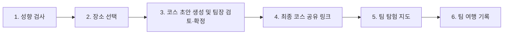

# Beyond May Be Backend

Beyond May Be는 여행 취향이 서로 다른 친구들이 함께 국내 여행을 계획할 수 있도록,
개인의 여행 성향을 분석하고 장소 탐색부터 여행 코스 생성·확정·탐험·기록까지
연결하는 서비스다.

이 저장소는 Beyond May Be의 **백엔드 API 서버**를 관리한다. 프런트엔드는 별도
저장소에서 관리하며, 이 문서는 팀 개발자와 AI 작업 도구가 백엔드의 목적, 현재 상태,
구조, 실행 방법과 안전 경계를 같은 기준으로 이해하기 위한 프로젝트 원문이다.

## 현재 개발 상태

현재 프로젝트는 Java·Spring Boot·PostgreSQL 기반 환경과 API 계층의 초기
스켈레톤을 구성한 단계다.

- 핵심 비즈니스 로직은 아직 구현되지 않았다.
- Controller, Service, DTO, Entity와 테스트는 이후 구현을 위한 초기 구조다.
- 현재 테스트에는 구조와 초안 계약을 검사하는 테스트가 포함되어 있으며, 테스트가
  존재한다는 사실이 해당 기능의 구현 완료를 뜻하지 않는다.
- API 요청·응답 계약은 구현 과정에서 변경될 수 있는 초안이다.

### 현재 확인된 실행 상태와 제한

2026-07-22 기준으로 로컬 검증 기준선은 Green 상태다.

- 방문 인증 경로는 `CoursePlaceController`만 소유하며 애플리케이션이 정상 기동한다.
- Docker Desktop의 Testcontainers PostgreSQL을 사용하는 전체 테스트가 2분 11초에
  통과했다.
- `spotlessCheck`와 전체 빌드가 통과했다. 전체 빌드는 테스트를 포함해 1분 56초가
  걸렸다.
- 실제 기동 환경에서 Health는 HTTP 200과 `UP`, Swagger UI와 OpenAPI JSON은 HTTP
  200을 반환했다. 방문 인증 경로는 OpenAPI에 한 번만 노출된다.
- 방문 인증은 GPS 요청·응답 계약과 고정 응답만 제공하는 스켈레톤이다. DB 저장, GPS
  거리 판정, 인증과 실제 사용자 식별은 아직 구현하지 않았다.

## 주요 사용자와 권한

주요 사용자는 여행 취향이 서로 다른 친구들과 국내 여행을 계획하는 소규모 그룹이다.

| 역할 | 인증 방식 | 주요 권한 |
|---|---|---|
| 팀장 | 로그인 | 팀의 유일한 로그인 사용자이자 코스 생성자다. 코스 초안을 수정하고 최종 코스를 확정한다. |
| 팀원 | 비로그인 공유 링크 | 팀장이 공유한 최종 코스와 탐험 정보를 조회한다. 코스를 수정하거나 투표하지 않는다. |

`팀장`, `코스 생성자`, `팀의 유일한 로그인 사용자`는 같은 사용자를 뜻한다.

## MVP 목표 흐름

다음 여섯 단계가 현재 팀이 구현하려는 MVP 전체 범위다.



이 흐름은 목표 제품 동작이며 현재 구현 완료 상태를 의미하지 않는다. 세부 분기,
권한과 아직 결정되지 않은 항목은 [상세 사용자 흐름](docs/product/user-flow.md)에서
확인한다.

## 주요 도메인과 책임

`Course`, `Schedule`, `TripSchedule`은 서로 다른 제품 도메인이 아니라 장소 선택부터
코스 확정과 탐험까지 이어지는 **여행 코스 도메인**을 현재 스켈레톤에서 나누어
표현한 이름이다.

| 패키지 | 현재 책임 |
|---|---|
| `user` | 팀장 로그인, 닉네임과 성향 정보의 초기 API 구조 |
| `question`, `mbti` | 여행 성향 질문, 결과 산출과 유형 정보 |
| `coreplace` | 장소 검색·추천과 탐험 중 주변 장소 정보 |
| `course`, `courseplace` | 여행 코스 생성·조회·확정과 코스에 포함된 장소 |
| `team` | 여행 팀 정보와 팀 단위 설정 |
| `travelLog` | 방문 처리와 팀 여행 기록 |
| `common`, `apiPayload` | 공통 설정, 보안·로깅, 응답과 예외 처리 |

패키지와 API 이름은 초기 스켈레톤이므로 비즈니스 로직 구현 중 변경될 수 있다.
API 계층을 변경할 때는 [API 계층 코딩 컨벤션](docs/api-layer-convention.md)을 따른다.

## 외부 연동 책임

- 프런트엔드는 Kakao Map으로 지도를 표시하고 Kakao Mobility API로 도보 경로를
  생성한다. 카카오 API 키는 이 백엔드 저장소에서 관리하지 않는다.
- 백엔드는 향후 AI 제공자를 호출해 코스 생성 결과를 프런트엔드에 제공한다.
  AI 제공자와 세부 추천 방식은 아직 결정되지 않았다.

## 기술 구성

- Java 21
- Spring Boot 4.0.7, Gradle Wrapper 9.5.1
- Spring Web MVC, Spring Security, Validation, WebSocket
- Spring Data JPA, PostgreSQL 17
- Spring Boot Actuator
- Springdoc OpenAPI
- JUnit 5, Testcontainers, ArchUnit
- Spotless와 Google Java Format

## 로컬 환경 준비

### 사전 조건

- 저장소 루트에서 명령을 실행한다.
- JDK 21을 설치한다.
- Docker와 Docker Compose를 실행할 수 있어야 한다.
- Windows에서는 PowerShell 또는 명령 프롬프트를 사용한다.

### 환경 변수

저장소 루트의 `.env.example`을 `.env`로 복사한다.

Windows PowerShell:

```powershell
Copy-Item .env.example .env
```

macOS/Linux:

```bash
cp .env.example .env
```

`.env`에는 로컬 환경의 실제 값을 기록하며 Git에 추가하지 않는다. `.env.example`에는
실제 비밀번호, API 키, 접근 토큰이나 실사용자 정보를 기록하지 않는다.

### PostgreSQL 실행

```bash
docker compose up -d postgres
docker compose ps
```

`postgres` 서비스가 `healthy` 상태가 되면 준비가 완료된다. 데이터는
`postgres_data` Docker 볼륨에 유지된다.

### 애플리케이션 실행

Windows:

```powershell
.\gradlew.bat bootRun
```

macOS/Linux:

```bash
./gradlew bootRun
```

다음 주소로 실행 상태를 확인한다.

- Health: <http://localhost:8080/actuator/health>
- Swagger UI: <http://localhost:8080/swagger-ui/index.html>
- OpenAPI JSON: <http://localhost:8080/v3/api-docs>

Health가 HTTP 200과 `UP` 상태를 반환하고 Swagger UI 및 OpenAPI JSON에 접근할 수
있으면 기본 실행 검증이 완료된 것이다.

## API 문서

- Swagger/OpenAPI는 현재 코드가 제공하는 요청·응답 계약을 보여준다.
- [Postman 자료](postman/README.md)는 실행 가능한 요청과 saved example의 원본이다.
- API 계약은 현재 초기 초안이며 API 변경 시 Swagger/OpenAPI와 Postman 자료를 함께
  갱신한다.

## 검증

모든 명령은 저장소 루트에서 실행한다. 통합 테스트와 전체 테스트는 Testcontainers를
사용할 수 있으므로 Docker가 필요하다.

| 목적 | Windows | macOS/Linux | 성공 조건 |
|---|---|---|---|
| 관련 테스트 | `.\gradlew.bat test --tests "전체.테스트.클래스명"` | `./gradlew test --tests "전체.테스트.클래스명"` | 선택한 테스트가 모두 통과한다. |
| 전체 테스트 | `.\gradlew.bat test` | `./gradlew test` | 모든 테스트가 통과한다. |
| 코드 품질 검사 | `.\gradlew.bat spotlessCheck` | `./gradlew spotlessCheck` | Spotless 위반이 없다. |
| 전체 빌드 | `.\gradlew.bat build` | `./gradlew build` | 빌드가 성공하고 테스트와 품질 검사가 통과한다. |

환경 문제나 기존 실패 때문에 검사를 실행하지 못한 경우 완료로 간주하지 않고 원인과
미실행 검사를 구분해 보고한다.

## 보호 영역과 변경 주의사항

- `.env`와 실제 비밀값은 출력하거나 커밋하지 않는다.
- 인증·보안 정책과 개인정보 처리 변경은 영향과 검증 방법을 먼저 확인한다.
- DB 스키마·데이터 삭제, 덮어쓰기와 되돌리기 어려운 변경은 실행 직전에 명시적인
  승인을 받는다.
- 로컬 설정은 Hibernate `ddl-auto=update`를 사용하므로 `DB_URL`을 공유·운영 DB로
  지정하지 않는다.
- 배포, 운영 환경 변경과 외부 서비스 쓰기 작업은 사용자의 명시적인 요청과 승인이
  있을 때만 실행한다.
- API 계약은 초안이지만 변경 시 관련 테스트, Swagger/OpenAPI와 Postman 자료를 함께
  검토한다.

## 관련 문서

- [상세 사용자 흐름](docs/product/user-flow.md)
- [API 계층 코딩 컨벤션](docs/api-layer-convention.md)
- [Postman 사용 안내](postman/README.md)
- [AI 하네스 문서](docs/harness/README.md)
- [하네스 완성 기준 및 평가표](docs/harness/completion-criteria.md)
