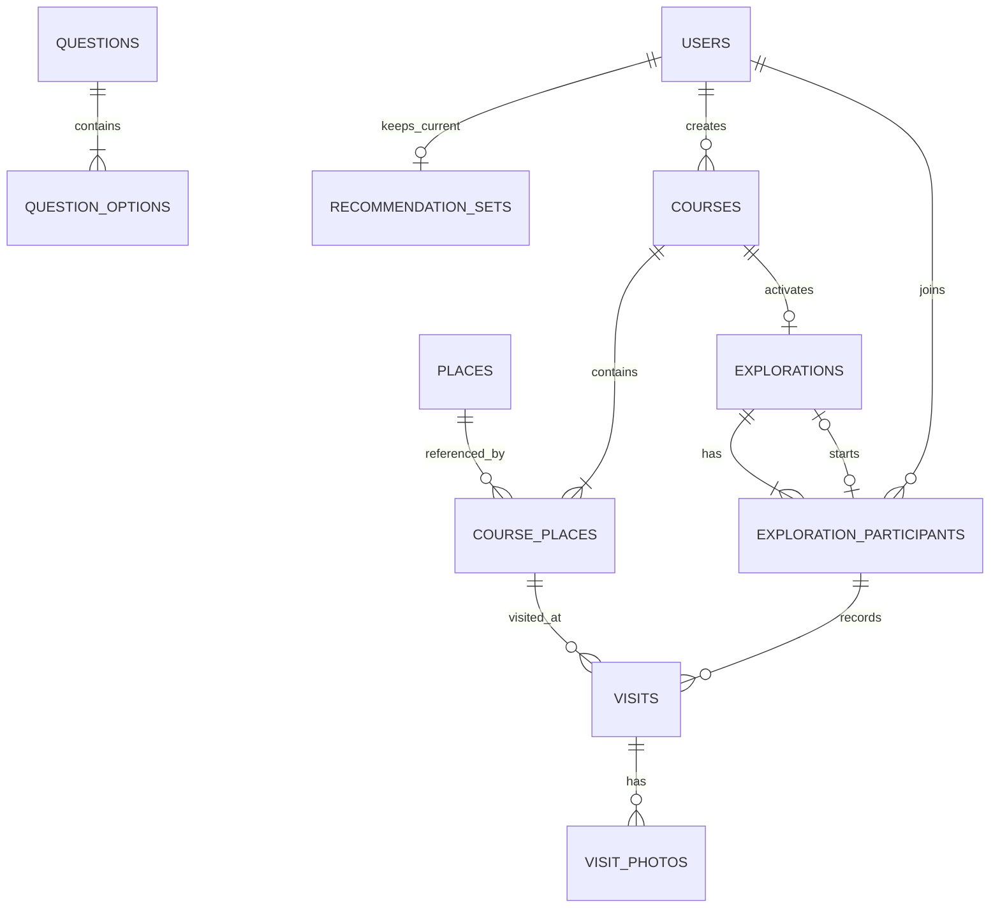

# Beyond May Be 백엔드 아키텍처

이 문서는 백엔드가 목표로 하는 도메인 책임, 영속 데이터 관계와 외부 시스템 경계를
정의하는 아키텍처 정본이다. 상세 화면 동작은 [기능 명세](../product/feature-spec.md),
현재 구현 상태는 [백엔드 MVP 상태](../product/mvp.md), 아직 확정되지 않은 조건은
[제품 논의 필요](../product/open-questions.md)를 따른다.

현재 코드가 이 문서와 다르면 이 문서를 목표 구조로 사용하되, 구현 완료 여부를
추정하지 않고 백엔드 MVP 상태와 실제 코드를 함께 확인한다.

## 설계 원칙

- 테이블 수가 아니라 데이터 소유권과 생명주기를 기준으로 Aggregate 경계를 나눈다.
- PostgreSQL은 재접속·공유·기록에 필요한 서버 정본을 보존한다.
- 현재 카드, 되돌리기와 일괄 전송 전 반응은 프런트엔드 로컬 스토리지에 둔다.
- `Course`와 `Exploration`은 생명주기가 다르므로 분리한다.
- 한국관광공사 OpenAPI는 초기 장소 수집에만 사용하고 런타임에는 `places`를 사용한다.
- Redis는 MVP 범위에서 사용하지 않는다.

## 도메인 책임

| 영역 | 책임 | 주요 영속 데이터 |
|---|---|---|
| 사용자·성향 | 간편 식별, 최종 여행 성향 | `users` |
| 성향 질문 | 21개 질문 풀, 선택지와 유형별 가중치 | `questions`, `question_options` |
| 장소·추천 | 검수된 장소 카탈로그, 사용자별 현재 추천 결과 | `places`, `recommendation_sets` |
| 코스 | AI 생성 결과, 방문 순서, 수정과 확정 | `courses`, `course_places` |
| 탐험 | 확정 코스의 팀 합류, 역할, 시작과 완료 | `explorations`, `exploration_participants` |
| 방문 기록 | 참여자별 방문 인증과 선택적 다중 사진 | `visits`, `visit_photos` |

## 인증과 권한

다음은 목표 백엔드 구조의 권한 경계다. 현재 구현 여부는
[백엔드 MVP 상태](../product/mvp.md)에서 확인하며, 사용자 식별 원칙은
[ADR-007](decisions.md#adr-007-추천-작업-상태는-user-소유이며-인증-구현과-분리한다)을 따른다.

| 작업 | 권한 |
|---|---|
| 질문·성향 계산, 유효한 공유 코스 미리보기 | 비인증 허용 |
| 기간·추천·반응·장소 선택 | 인증된 사용자 |
| `DRAFT` 코스 수정·확정 | 해당 `Course` 소유자 |
| 공유 코스 합류 | 인증된 사용자, 활성 참여 없음, 유효한 공유 만료 시각 |
| 탐험 시작·팀원 조회·주변 장소 추천 | 해당 `Exploration`의 `ACTIVE Participant` |
| 방문 인증·사진 첨부 | 해당 코스의 `ACTIVE Participant` |
| 팀 방문 기록 조회 | 해당 `Exploration`의 현재 또는 과거 `Participant` |
| 개인 누적 기록·밝힌 지도 조회 | 본인 사용자 |

인증된 요청의 사용자·참여자 식별자는 body나 query 값이 아니라 서버가 확인한
인증 컨텍스트와 참여 관계에서 결정한다. 구체적인 인증 토큰·세션 방식은 별도 인증
설계 범위다. 공유 만료, 참여 상태, 방문 소속과 공개 범위가 바뀌면 이 표를 제품
논의 필요 문서와 함께 갱신한다.

## 목표 논리 관계



## 테이블별 기준

### `users`

- `user_id`가 내부 식별자다.
- `(nickname, identifier_code)`가 표시·간편 로그인 식별자이며 복합 유일하다.
- 같은 닉네임에서 비어 있는 `1~99`를 무작위 배정하고, 모두 사용 중이면 `100`부터
  순차 배정한다.
- `identifier_code`는 공개 가능한 자연수이며 강한 인증 수단으로 간주하지 않는다.
- `preference_type`과 네 유형 점수는 성향 검사 전에는 모두 null이고, 검사 완료 후에는
  모두 값이 있어야 한다.
- `Mbti`와 `Team`을 직접 참조하지 않는다.

인증 구현과 토큰·세션 저장 방식은 별도 인증 설계 범위다. 이 문서는 인증 방식이
제공하는 현재 `User` 컨텍스트와 업무 데이터의 관계만 정의한다.

### `questions`, `question_options`

- 질문 하나는 순서가 있는 선택지 네 개를 가진다.
- 선택지는 사색러·미식러·예술러·기억러 네 유형 가중치를 가진다.
- 서비스는 21개 질문 풀에서 7개를 선별하며 동점이면 추가 질문으로 결정한다.

### `places`

- 이름, 카테고리, 단일 `TravelMbti` 유형, 태그 배열, 주소, 좌표, 운영시간, 설명,
  썸네일과 활성 상태를 보존한다.
- `tags`는 PostgreSQL JSONB 문자열 배열로 저장한다.
- 5·18 연관 의미는 별도 컬럼 없이 검수된 `description`에 포함한다.
- 외부 제공자와 콘텐츠 ID, 추천 점수, 동기화 시각은 저장하지 않는다.
- 코스가 참조하는 Place는 hard delete하지 않는다.

### `recommendation_sets`

- `user_id`가 유일하며 사용자마다 현재 추천 세트 하나만 둔다.
- 여행 기간, 실제 시작·종료일, 순서가 있는 추천 Place ID 배열과 최종
  좋아요·싫어요 ID 배열을 저장한다.
- 인증 세션이 만료되거나 바뀌어도 같은 사용자가 재인증하면 기존 추천 세트를
  조회할 수 있다.
- 기간을 바꾸면 `recommendation_set_id`는 유지하고 같은 행의 기간·추천 ID를
  덮어쓰며 좋아요·싫어요 배열은 초기화한다.
- 전체 스와이프가 끝난 뒤 프런트엔드가 좋아요·싫어요를 한 번에 전송한다.
- 추가 추천은 기존 추천 ID를 제외해 같은 배열 뒤에 붙인다.
- `recommendation_items` 하위 테이블은 두지 않는다.

### `courses`, `course_places`

- AI 생성 성공 시 `Course(DRAFT)`와 `CoursePlace`를 저장하고 `course_id`를 발급한다.
- 여행 기간은 `DAY_TRIP`, `ONE_NIGHT_TWO_DAYS`, `TWO_NIGHTS_THREE_DAYS`,
  `CUSTOM`으로 구분한다.
- 모든 코스는 `start_date`, `end_date`, `start_time`을 저장한다. `CUSTOM`은 3박 4일
  이상 직접 선택 기간이다.
- Course는 제목, 소유자, 상태, 공유 만료 시각과 서버 관리 AI 수정 횟수를 가진다.
- AI 수정은 최대 2회이며 조건부 갱신으로 동시 초과를 막는다.
- CoursePlace는 Place 참조, 일자, 일자 내 순서, 예상 체류시간과 이전 장소에서의
  이동수단을 가진다.
- `(course_id, place_id)`와 `(course_id, day_number, visit_order)`는 유일하다.
- 폴리라인, 거리, 이동시간과 예상 도착시간은 저장하지 않는다. 프런트엔드가
  CoursePlace 순서와 좌표로 Kakao Maps 경로 API를 호출한다.

### `explorations`, `exploration_participants`

- Course 하나에는 전체 생명주기에서 Exploration이 최대 하나 존재한다.
- Course 확정 시 `Exploration(BEFORE)`과 생성자 `Participant(OWNER, ACTIVE)`를
  생성한다.
- 별도 `Team` 테이블 없이 Participant가 역할, 상태, 표시 이름과 위치 공유 동의를
  소유한다.
- 사용자는 `BEFORE`와 `ONGOING`을 합쳐 활성 Participant를 최대 하나만 가진다.
- 같은 Exploration의 활성 Participant는 탐험을 시작할 수 있으며 최초 요청만
  `BEFORE → ONGOING` 전환에 성공한다.
- 시작한 Participant는 `started_by_participant_id`로 기록한다.
- 지도 이탈 시 Participant를 `LEFT`로 바꾸고 기존 방문 기록은 보존한다.

### `visits`, `visit_photos`

- Visit은 `participant_id`, `course_place_id`, `visited_at`을 가진다.
- `(participant_id, course_place_id)`가 유일해 같은 참여자의 동일 장소 재인증을
  막는다.
- 서버는 요청 GPS와 Place 좌표의 거리를 검사하지만 원본 GPS는 저장하지 않는다.
- 팀 지도 완료 여부는 해당 CoursePlace Visit 존재 여부, 개인 완료 여부는 현재
  Participant의 Visit 존재 여부로 계산한다.
- Visit에는 사진을 선택적으로 여러 장 연결할 수 있다.
- 사진 파일은 객체 저장소, DB에는 비공개 `object_key`와 표시 순서를 저장한다.
- `(visit_id, display_order)`는 유일하다.

## 상태 전환

### Course와 Exploration

```text
AI 생성 성공
→ Course(DRAFT)
→ AI 또는 직접 수정
→ Course(CONFIRMED) + Exploration(BEFORE) + Owner Participant(ACTIVE)
→ 공유 링크 생성 시 share_expires_at 설정
→ 활성 Participant의 시작 요청
→ Exploration(ONGOING)
→ 완료 조건 충족 또는 완료 요청
→ Exploration(COMPLETED)
```

- `CONFIRMED` Course와 CoursePlace는 직접 수정할 수 없다.
- 다른 참여자가 합류하기 전에는 확정을 취소해 Course를 `DRAFT`로 되돌리고 빈
  Exploration과 생성자 참여를 정리할 수 있다.
- 공유 URL은 `/explore/{course_id}`로 조합하며 문자열을 저장하지 않는다.
- 링크 생성 시 3일 뒤를 `share_expires_at`으로 저장하고, 재발급 시 같은 URL의
  만료 시각만 연장한다.

### Participant

```text
합류 → ACTIVE
기존 지도 이탈 → LEFT
Exploration 완료 → COMPLETED
```

새 지도 합류 시 기존 `ACTIVE` 참여가 있으면 기존 지도로 돌아가거나 기존 참여를
`LEFT`로 바꾼 뒤 합류해야 한다.

## 데이터와 외부 시스템 경계

| 저장소·시스템 | 책임 |
|---|---|
| PostgreSQL | 사용자, 질문, 장소, 추천 결과, 코스, 탐험, 방문과 사진 메타데이터 |
| 프런트엔드 로컬 스토리지 | 가입 전 검사 결과, 현재 카드, 되돌리기, 일괄 전송 전 반응 |
| 한국관광공사 OpenAPI | 초기 광주 장소 수집 입력. 런타임 정본이 아님 |
| Kakao Maps API | 프런트엔드 지도, 경로, 거리, 이동시간과 예상 도착시간 계산 |
| 객체 저장소 | 방문 인증 사진 원본 |
| WebSocket | 방문 완료·팀 진행과 동의한 참여자의 일시적 위치 이벤트 전파. 위치 이벤트는 10m 이동 기준으로 갱신 |

AI 요청 중에는 프런트엔드가 버튼을 비활성화하고 자동 재시도하지 않는다. MVP는
서버 영속 멱등성 키를 두지 않으므로 네트워크 중복까지 보장하지 않는다.

## 무결성과 오류 처리

- 식별코드 배정은 `(nickname, identifier_code)` 유일 제약 충돌 시 재시도한다.
- 추천 세트에 저장하는 Place ID는 모두 `places` 존재 여부를 검증한다.
- Course 확정·취소, Exploration 시작과 AI 수정 카운트는 현재 상태를 조건으로
  갱신한다.
- 공유 링크 만료는 `share_expires_at`으로 판정하며 만료된 신규 합류 요청은 410으로
  거부한다.
- 방문 인증은 Participant가 활성 상태이고 CoursePlace가 같은 Exploration의
  Course에 포함되는지 한 트랜잭션에서 검사한다.
- 사진 업로드 실패는 Visit을 취소하지 않는다. 객체 업로드 후 DB 저장이 실패하면
  객체 삭제를 시도하고 남은 고아 객체는 운영 정리 대상으로 처리한다.

## 현재 구현과 스키마 변경

- 현재 JPA Entity와 API 골격은 목표 구조와 다를 수 있다. 기능별 진행 상태는
  [백엔드 MVP 상태](../product/mvp.md)에서 확인한다.
- `ddl-auto=update`만으로 삭제·rename·데이터 변환을 적용하지 않는다.
- 실제 반영 전 버전 마이그레이션 도구를 결정하고, 새 테이블과 nullable FK를 먼저
  추가하는 additive migration을 우선한다.
- 기존 테이블 삭제나 공유 Docker volume 초기화는 별도 구현 계획과 실행 직전 승인을
  거친다.

## 아직 확정되지 않은 정책

다음 조건은 테이블 관계를 다시 설계하지 않고 검증·조회 규칙으로 수용한다. 현재
상태와 상세 쟁점은 [제품 논의 필요](../product/open-questions.md)를 정본으로 사용한다.

- 추천 장소 10개·20개 중 최종 개수
- 참여자별 동일 장소 인증과 팀원의 개인 기록 공개 범위
- 방문 인증 반경과 GPS 미허용 처리
- 전체 방문 자동 완료와 별도 완료 버튼 중 최종 방식

## 갱신 규칙

- 제품 정책이 바뀌면 기능 명세와 이 문서를 같은 Pull Request에서 갱신한다.
- 코드가 목표 구조를 구현하면 백엔드 MVP 상태의 근거와 상태도 함께 갱신한다.
- 새로운 테이블 관계나 데이터 소유권 변경은 설계 승인을 먼저 받는다.
