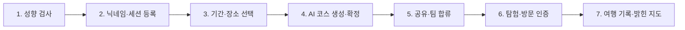

# Beyond May Be 사용자 흐름

이 문서는 현재 제품의 사용자 역할과 종단 흐름을 짧게 설명한다. 세부 화면 동작과
예외는 [상세 기능 명세](feature-spec.md), 백엔드 구현 상태는
[백엔드 MVP 상태](mvp.md)를 따른다.

## 사용자와 세션

### 신규 사용자

- 서비스에 처음 진입해 성향 검사를 진행할 수 있다.
- 성향 검사 뒤 닉네임을 등록하면 서버가 식별코드와 세션을 발급한다.
- 식별코드는 세션 복구에 사용하며 분실하면 계정을 복구할 수 없다.

### 코스 생성자

- 닉네임 세션을 가진 사용자다.
- 여행 기간과 장소를 선택하고 AI 코스를 생성·수정·확정한다.
- 확정 코스의 공유 링크를 만들고 직접 탐험을 시작할 수 있다.

### 공유 링크 참여자

- 공유 링크로 확정 코스를 조회한다.
- 세션이 없으면 닉네임을 등록하고 식별코드를 발급받아 팀에 합류한다.
- 기존 세션이 있으면 닉네임과 식별코드로 로그인한 뒤 중복 없이 합류한다.
- 탐험 전 코스를 확인하고 탐험을 시작한 뒤 방문 인증과 여행 기록에 참여한다.

코스 생성자와 공유 링크 참여자는 모두 닉네임 세션 사용자다. 코스 설계·확정 권한은
코스 생성자에게만 있다.

## 종단 흐름

### 1. 성향 검사

사용자는 21개 질문 풀에서 기본 7개 질문에 답하며, 동점이면 질문 1개를 추가한다. 백엔드는
응답 가중치를 계산해
사색러, 미식러, 예술러, 기억러 중 하나의 최종 여행 성향과 네 유형별 비율을 반환한다.

### 2. 닉네임·세션 등록

사용자는 성향 결과와 닉네임으로 세션을 만든다. 서버가 발급한 식별코드는 이후
사이드바나 공유 링크에서 기존 세션을 복구하는 자격 정보로 사용한다.

### 3. 기간·장소 선택

세션 사용자는 여행 기간을 설정하고 성향·기간 기반 추천 장소를 스와이프해 선택한다.
추천은 회차당 20곳씩 제공하며 사용자의 사색러·미식러·예술러·기억러 비율에 맞춰
유형별 장소 수를 배분한다. 예를 들어 비율이 4:3:2:1이면 각각 8곳·6곳·4곳·2곳을
제공한다. 최초 배분에 필요한 DB 장소가 부족하면 서버는 TourAPI 광주 변경분을 한 번
조회해 유효한 신규 장소를 저장하고 같은 추천 후보로 사용한다. 외부 조회가 실패하거나
새 장소가 없으면 기존 DB 후보를 재배분한다. 기간별 최소 장소 수를 충족하지 못했더라도
최초 추천이 빈 목록이면 빈 상태로 끝낸다. 그 밖에는 미노출 활성 장소를 최대 20곳 추가로
제공한다. 미노출 후보가 부족하면 해당 추가 회차 요청에서 TourAPI 변경분을 한 번 조회하고,
그래도 20곳보다 적으면 남은 장소를 중복 없이 최종 부분 회차로 제공한다. 각 회차가
끝나면 좋아요·싫어요 전체를 서버에 저장한다. 재진입 시 서버는 저장된 모든 회차와 확정
반응을 반환하며, 아직 일괄 전송하지 않은 반응과 현재 카드 위치는 프런트엔드가 관리한다.
서버가 확정한 회차별
최대 60곳 안에서 Groq가 다음 ID 순서를 선별한다.
응답 전체 검증이나 외부 호출이 실패하면 같은 입력의 안정적인 규칙 순서를 사용한다.
새 추천 응답에 포함된 장소의 설명·운영시간이 비어 있으면 응답과 분리된
최선 노력 작업으로 DB를 보강한다. 사용자가 장소 상세를 열었는데 값이 여전히 비어 있으면
서버는 필요한 TourAPI만 동기 조회해 저장하고 같은 상세 응답에 포함한다. 최소 기준을
만족하면 선택한 장소를 코스 생성 단계로 전달한다.

### 4. AI 코스 생성·확정

백엔드는 선택한 장소를 대상으로 방문 순서와 동선을 포함한 코스 하나를 만든다.
코스 생성자는 AI 수정 또는 직접 수정을 거쳐 코스를 확정한다. 확정 뒤에는 코스를
수정할 수 없으며 공유 링크와 탐험 시작 기능이 활성화된다.

### 5. 공유·팀 합류

코스 생성자는 확정 코스의 공유 링크를 전달한다. 공유 링크 참여자는 새 세션을
발급받거나 기존 세션으로 로그인해 팀에 합류하고, 탐험 전 지도와 팀원 목록을
확인한다.

### 6. 탐험·방문 인증

탐험 시작 뒤 사용자는 현재 위치와 코스를 지도에서 확인한다. 주변 추천은 활성 참여자가
직접 요청할 때 현재 위치 1km 안의 광주 장소를 코스 장소 제외·거리순 최대 3곳으로
받으며, 외부 조회가 실패하면 저장된 장소를 사용한다. 주변 추천과 단순 방문 인증 요청은
REST API로 처리한다. 방문 인증은 서버가 100m 반경과 50m 위치 정확도
기준을 검증한 뒤 참여자별 Visit을 저장하며, 검증에 사용한 원본 GPS 좌표는 보존하지
않는다. 최초 인증은 팀 장소 완료를 만들지만 다른 팀원도 개인 방문 기록을 남길 수
있다. 주변 추천 장소 방문은 밝힌 지도와 방문 기록에는 포함하고 코스 완료율에서는
제외한다. 팀원 위치 공유와 방문 상태 갱신은 WebSocket 이벤트로 팀 전체에 실시간
전달한다.

### 7. 여행 기록·밝힌 지도

사용자는 진행 중·완료 코스와 팀 전체 방문 기록을 확인한다. 전체 코스 장소가 팀
완료되면 자동 완료되며 OWNER는 그 전에 조기 완료할 수 있다. 방문한 장소는 밝힌
지도에 누적되며, 전체 결과를 저장하거나 공유할 수 있다.

## 진입 상태별 분기

| 현재 상태 | 이동 위치 |
|---|---|
| 세션 없음 | 서비스 시작·성향 검사 |
| 성향 결과만 있고 닉네임 없음 | 닉네임·세션 등록 |
| 세션 있음, 확정 코스 없음 | 여행 기간·장소 선택 |
| 확정 코스 있음, 탐험 시작 전 | 코스 미리보기 |
| 탐험 진행 중 | 팀 탐험 지도 |

세션 판별 API의 응답 상세는 아직 [논의가 필요하다](open-questions.md).
탐험 상태 전환 기준은 [백엔드 아키텍처](../architecture/backend.md)와 상세 기능 명세를 따른다.

## 프런트엔드와 백엔드 책임

- 프런트엔드: Kakao Maps 지도·마커·동선 표시, 스와이프와 로컬 임시 상태, GPS 권한
  요청, 공유·저장 UI를 담당한다.
- 백엔드: 세션·식별코드, 성향 계산, 장소 추천, 코스·팀 상태, 공유 링크, 방문 인증,
  여행 기록과 실시간 이벤트를 담당한다.
- 프런트엔드와 백엔드의 통합 시연 상태는 후속 데모 runbook에서 관리한다.
