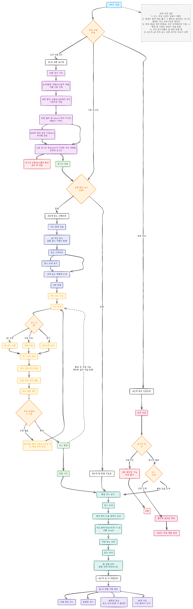

# Beyond May Be MVP 사용자 흐름

- 상태: 목표 사용자 흐름
- 기준 일자: 2026-07-22
- 구현 상태: 백엔드 환경과 API 스켈레톤 구성 단계

이 문서는 Beyond May Be MVP의 목표 사용자 흐름과 역할별 권한을 설명한다. 현재 코드의
구현 완료 목록이 아니며, 원본 플로우차트와 문서의 설명이 다르면 사용자와 확인하여
확정한 이 문서의 규칙을 우선한다.

## 상세 플로우차트

## 사용자 역할

### 팀장

- 팀의 유일한 로그인 사용자다.
- 코스 생성자와 같은 사용자다.
- 코스 초안을 수정하고 최종 코스를 확정한다.
- 최종 코스를 공유 링크로 팀원에게 전달한다.

### 팀원

- 로그인하지 않고 공유 링크로 접근한다.
- 팀장이 공유한 최종 코스와 탐험 정보를 조회한다.
- 코스를 수정하거나 투표하지 않는다.

원본 플로우차트의 `투표` 표현은 여러 팀원이 참여하는 투표가 아니라 팀장이 코스
초안을 검토하여 수정 또는 확정을 결정하는 절차를 뜻한다. 이 문서에서는 이를
`팀장 검토·확정`으로 표현한다.

## 1단계: 성향 검사

신규 사용자는 여행 지역과 선호를 묻는 성향 검사를 진행한다. 검사 결과는 장소 추천과
코스 생성에 사용할 여행 성향으로 정리한다. 팀장이 더 자세한 추천 계획을 확인하고
코스를 만들려면 로그인을 완료한다.

## 2단계: 장소 선택

확정 코스가 없는 팀장은 지도에서 성향 결과를 반영한 추천 장소를 확인한다. 장소를
살펴보고 상세 정보를 확인한 뒤 코스 후보 목록에 누적한다.

## 3단계: 코스 초안과 팀장 검토·확정

선택한 장소를 바탕으로 코스 초안을 만든다. 팀장은 AI 수정, 직접 수정 또는 초안 유지
중 하나를 선택하여 초안을 검토한다. 검토 결과에 따라 다시 수정하거나 코스를
확정한다. 확정된 최종 결과는 공유 링크로 팀원에게 전달한다.

## 4단계: 최종 코스 공유 링크

비로그인 팀원은 공유 링크로 진입해 팀장이 확정한 코스를 조회한다. 팀원은 코스를
수정하거나 투표하지 않는다.

## 5단계: 팀 탐험 지도

팀장과 팀원은 확정 코스, 현재 위치와 다음 목적지 안내, 지도 탐험 정보, 주변 장소와
팀 진행 상태를 확인한다. Kakao Map 지도 표시와 Kakao Mobility API 도보 경로 생성은
프런트엔드가 담당한다.

## 6단계: 팀 여행 기록

탐험이 끝난 뒤 진행 중인 코스와 완료한 코스, 방문한 장소, 여행 중 밝힌 지도 영역을
팀 여행 기록에서 확인한다.

## 외부 연동

- 프런트엔드: Kakao Map, Kakao Mobility API
- 백엔드: 향후 AI 코스 생성 제공자 연동

## 미결정 사항

- 백엔드가 사용할 AI 제공자와 모델
- 여행 성향을 장소 추천에 반영하는 구체적인 추천 알고리즘
- 사용자가 선택한 장소 외에 AI가 추가로 추천할 장소의 수와 기준

미결정 사항을 확정할 때 구현 구조에 장기적인 영향을 주는 결정은 별도의 설계 문서나
ADR로 기록한다.
